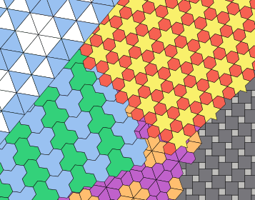

Inkscape Tiling Extension
=========================

Description
-----------

This Extension uses the library Tessagon to create tiling patterns
through a user interface in Inkscape.



Installation
------------

First, identify your Inkscape extensions directory.  This can be found in  Inkscape's preferences: Go to *Edit* → *Preferences* → *System* and look in the *User extensions* field.  On Linux, the extensions directory is typically `$HOME/.config/inkscape/extensions/`.

Second, install the Inkscape Tiling Extension in that directory or any subdirectory.  For example,
```bash
cd $HOME/.config/inkscape/extensions/
git clone  --recurse-submodules https://github.com/cwant/inkscape-tiling-extension.git
```
will retrieve the code from GitHub.  This later can be updated with
```bash
cd $HOME/.config/inkscape/extensions/inkscape-tiling-extension
git pull
git submodule update --remote
```

If Inkscape is already running, exit and restart it to make it look for new extensions.

Acknowledgements
----------------

* I would like to thank Scott Pakin for writing his great Simple Inkscape Scripting
extension, which helped me initially get Tessagon tilings into Inkscape (I've also
liberally stolen parts of this README file from his project). You can find his extension here:
<https://github.com/spakin/SimpInkScr>.